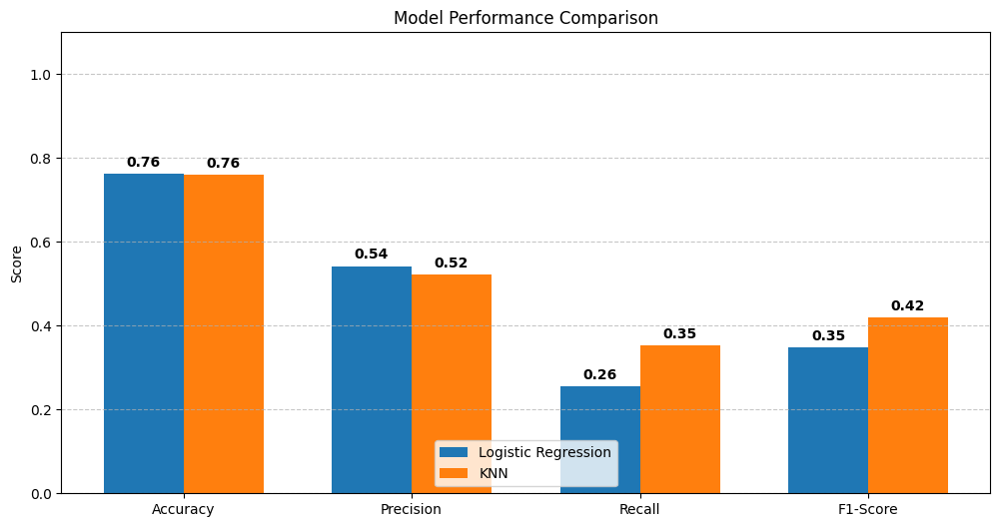

<div align="center">

# VNU-HCM, UNIVERSITY OF SCIENCE
## FACULTY OF INFORMATION TECHNOLOGY
### PROGRAMMING OF DATA SCIENCE

---

# HR ANALYTICS: JOB CHANGE OF DATA SCIENTISTS
### HOMEWORK 2 - NUMPY FOR DATA SCIENCE

</div>

## 1. Project Title & Description
**Project: Prediction of Candidate Job Change (Binary Classification)**

This project constructs a complete Machine Learning pipeline built **from scratch**, strictly utilizing the **NumPy** library (without reliance on Pandas or Scikit-learn for core logic). The objective is to predict whether a Data Scientist candidate will **leave** or **stay** with the company after training. This helps the HR department optimize recruitment costs and retention strategies.

## 2. Table of Contents
1. [Introduction](#3-introduction)
2. [Dataset](#4-dataset)
3. [Methodology](#5-methodology)
4. [Installation & Setup](#6-installation--setup)
5. [Usage](#7-usage)
6. [Results](#8-results)
7. [Project Structure](#9-project-structure)
8. [Challenges & Solutions](#10-challenges--solutions)
9. [Future Improvements](#11-future-improvements)
10. [Contributors](#12-contributors)
11. [License](#13-license)

---

## 3. Introduction
* **Problem Statement:** Binary Classification (0: Stay, 1: Leave).
* **Motivation:** Recruitment and training are costly and time-consuming. Predicting the probability of a candidate changing jobs allows the company to filter applications more effectively or implement retention policies.
* **Specific Objectives:**
    * Build a Data Preprocessing Pipeline using **pure NumPy**.
    * Implement **Logistic Regression** and **K-Nearest Neighbors (KNN)** algorithms from scratch.
    * Optimize **F1-Score** to handle the imbalanced dataset effectively.

## 4. Dataset
* **Source:** [HR Analytics: Job Change of Data Scientists](https://www.kaggle.com/arashnic/hr-analytics-job-change-of-data-scientists)
* **Dimensions:**
    * Training set: ~19,000 rows.
    * Features: 13 columns (Demographics, Experience, Company Size, etc.).
* **Characteristics:**
    * **Imbalanced:** The "Stay" class (~75%) significantly outnumbers the "Leave" class (~25%).
    * **Mixed Data Types:** Contains numerical (Training hours), ordinal (Education level), and nominal data (Gender, City).
    * **Missing Values:** Significant missing data in columns like `company_type` (~30%).

## 5. Methodology
This project strictly adheres to the **"NumPy Only"** rule for core algorithms and data processing.

### 5.1. Data Preprocessing Pipeline
1.  **Cleaning:** Handling non-standard strings (e.g., `>20`, `<1`) and type conversion.
2.  **Imputation:**
    * Numerical: Filled with `Median` (robust to outliers).
    * Categorical: Filled with `Mode` or a new "Unknown" category.
3.  **Feature Engineering:** Applied Log-transformation to `training_hours` to reduce skewness.
4.  **Encoding (NumPy Implementation):**
    * *Ordinal Encoding:* Dictionary mapping (e.g., Phd -> 4, Masters -> 3).
    * *One-Hot Encoding:* Utilized **Broadcasting** to generate binary matrices: `(col[:, None] == categories[None, :])`.
5.  **Scaling:** Z-score Standardization ($Z = \frac{X - \mu}{\sigma}$).

### 5.2. Algorithms (Implemented from Scratch)

#### A. Logistic Regression
* **Model:** Linear combination with Sigmoid activation.
    $$\hat{y} = \sigma(w \cdot X + b) = \frac{1}{1 + e^{-(w \cdot X + b)}}$$
* **Loss Function:** Log Loss (Binary Cross-Entropy).
    $$J(w,b) = - \frac{1}{m} \sum_{i=1}^{m} [y^{(i)}\log(\hat{y}^{(i)}) + (1-y^{(i)})\log(1-\hat{y}^{(i)})]$$
* **Optimization:** Gradient Descent.
    $$w := w - \alpha \frac{\partial J}{\partial w}$$

#### B. K-Nearest Neighbors (KNN)
* **Principle:** Lazy learning. Prediction based on the majority vote of the $K$ nearest data points.
* **Distance Metric:** Euclidean Distance (optimized via NumPy Broadcasting).
    $$d(x, x') = \sqrt{\sum_{i=1}^{n} (x_i - x'_i)^2}$$

## 6. Installation & Setup
To avoid dependency conflicts, it is recommended to use a Virtual Environment.

**Step 1: Create a Virtual Environment**
```bash
python -m venv .venv
```
**Step 2: Activate the Environment**
### Windows:
```bash
.venv\Scripts\activate
```
### Mac/Linux:
```bash
source .venv/bin/activate
```
**Step 3: Install Dependencies**
```bash
pip install -r requirements.txt
```

## 7. Usage
To reproduce the results, please execute the Jupyter Notebooks in the specific order below. This ensures that data dependencies are met (e.g., File 03 requires data generated by File 02).

**Prerequisite:** Ensure your virtual environment is activated and dependencies are installed.

### Execution Order

**1. Data Exploration** (`notebooks/01_data_exploration.ipynb`)
* **Goal:** Visualize data distribution, understand feature characteristics, and identify imbalances.
* **Action:** Open file $\rightarrow$ Click "Run All".

**2. Data Preprocessing** (`notebooks/02_preprocessing.ipynb`)
* **Goal:** Clean raw data, handle missing values, and perform Feature Engineering using pure **NumPy** operations.
* **Input:** Reads `data/raw/aug_train.csv` and `aug_test.csv`.
* **Output:** Generates processed files in `data/processed/` (`aug_train.csv`, `aug_test.csv`, `test_ids.csv`).
* **Note:** This step **MUST** be completed before running the modeling step.

**3. Modeling & Submission** (`notebooks/03_modeling.ipynb`)
* **Goal:** Train models (Logistic Regression & KNN) implemented from scratch, evaluate performance using Cross-Validation, and generate predictions.
* **Output:** Saves the final prediction file to `submissions/submission.csv`.

## 8. Results

### 8.1. Model Performance Metrics
The models were evaluated on the **Validation Set (20% hold-out)** using four key metrics. Given the imbalanced nature of the dataset (Target 0: ~75%, Target 1: ~25%), **F1-Score** and **Recall** are prioritized over Accuracy.

| Metric | Logistic Regression | K-Nearest Neighbors (K=15) |
| :--- | :--- | :--- |
| **Accuracy** | 0.7614 | 0.7591 |
| **Precision**| **0.5422** | 0.5226 |
| **Recall** | 0.2563 | **0.3519** |
| **F1-Score** | 0.3481 | **0.4206** |

### 8.2. Visualization & Analysis

*(Note: Detailed charts and Confusion Matrix heatmaps can be generated by running `notebooks/03_modeling.ipynb`)*

#### A. Confusion Matrix Analysis
* **Logistic Regression:**
    * Predicted "Leave" correctly (True Positive): **244** candidates.
    * Missed potential leavers (False Negative): **708** candidates.
    * *Insight:* The model is conservative. It has higher precision (fewer false alarms) but misses a large portion of the target class.
* **K-Nearest Neighbors (KNN):**
    * Predicted "Leave" correctly (True Positive): **335** candidates.
    * Missed potential leavers (False Negative): **617** candidates.
    * *Insight:* KNN is more sensitive. It successfully identified **~100 more** potential job changers than Logistic Regression.

#### B. Comparative Analysis
1.  **The Accuracy Trap:** Both models show similar Accuracy (~76%). However, a "dummy" model predicting "Stay" for everyone would also achieve ~75%. This confirms that Accuracy is a poor metric for this specific problem.
2.  **Why KNN outperformed Logistic Regression?**
    * **Non-linearity:** The relationship between features (like `city_development_index`, `experience`) and the target is likely non-linear. Logistic Regression attempts to draw a straight line (linear boundary), failing to capture complex patterns.
    * **Local Clusters:** KNN excels at finding local clusters of similar candidates. By tuning `K=15`, we smoothed out the noise while retaining the ability to detect pockets of employees at risk of leaving.


### 8.3. Conclusion
**K-Nearest Neighbors (KNN)** is selected as the final model because:
1.  It achieved a **higher F1-Score (0.42 vs 0.35)**.
2.  It demonstrated superior **Recall**, which is crucial for HR retention strategies (it is better to intervene with an employee who *might* stay than to ignore an employee who *will* leave).

## 9. Project Structure

The project is organized into modular components to separate data, source code, and experiments.

```text
LTKHDL-HR-ANALYTICS-NUMPY-PROJECT/
│
├── data/                        # Data storage
│   ├── raw/                     # Original immutable data (from Kaggle)
│   │   ├── aug_train.csv
│   │   ├── aug_test.csv
│   │   └── sample_submission.csv
│   └── processed/               # Cleaned data ready for modeling
│       ├── aug_train.csv        # Processed features + Target
│       ├── aug_test.csv         # Processed features for prediction
│       └── test_ids.csv         # Enrollee IDs extracted for submission
│
├── notebooks/                   # Jupyter Notebooks for experimentation
│   ├── 01_data_exploration.ipynb # EDA, Univariate & Bivariate analysis
│   ├── 02_preprocessing.ipynb    # Missing value imputation, Encoding (NumPy)
│   └── 03_modeling.ipynb         # Model training, Cross-Validation, & Prediction
│
├── results/                     # Analysis artifacts & Final Output
│   ├── images/                  # Saved charts for documentation
│   │   ├── comparison_measure.png
│   │   └── comparison_confusion_matrix.png
│   └── submission/              # Final prediction folder
│       └── submission.csv       # The final output file for submission
│
├── src/                         # Source code (Core Logic)
│   ├── __init__.py              # Makes 'src' a Python package
│   ├── data_processing.py       # Helper functions for data cleaning/splitting
│   ├── models.py                # LogisticRegression, KNN, and Metrics implementation
│   └── visualization.py         # Helper functions for plotting
│
├── .gitignore                   # Files to ignore in Git (e.g., .venv)
├── README.md                    # Project documentation
└── requirements.txt             # List of dependencies
```


## 10. Challenges & Solutions

Working strictly with **NumPy** imposes significant constraints compared to using high-level libraries like Pandas or Scikit-learn. Below are the key technical challenges encountered and the solutions implemented.

### Challenge 1: Absence of `pd.get_dummies` for One-Hot Encoding
* **The Issue:** Handling categorical variables (e.g., *City, Gender*) is complex. Without Pandas, we cannot simply call `get_dummies`. A naive implementation using Python `for` loops to iterate through rows would be computationally expensive and slow.
* **The Solution:** Implemented **Vectorized One-Hot Encoding** using NumPy broadcasting.
    * We identified unique categories using `np.unique()`.
    * We utilized the comparison `(column[:, None] == categories[None, :])` to generate a boolean matrix instantly, then cast it to integers. This removed the need for explicit loops.

### Challenge 2: Computational Cost of KNN (The "Curse of Loops")
* **The Issue:** K-Nearest Neighbors requires calculating the distance between a query point and *every* point in the training set. Implementing this with standard Python loops results in extremely slow prediction times, especially with ~15,000 training rows.
* **The Solution:** Leveraged **NumPy Broadcasting** for distance calculation.
    * Instead of iterating, we computed the Euclidean distance matrix for the entire dataset at once using vector operations: `np.sqrt(np.sum((X_train - x)**2, axis=1))`.
    * This reduced inference time from minutes to seconds.

### Challenge 3: The "Accuracy Paradox" in Imbalanced Data
* **The Issue:** The dataset is highly imbalanced (~75% "Stay" vs. ~25% "Leave"). Initially, the models yielded **75% Accuracy** but **0.0 F1-Score** because they simply predicted "Stay" (Class 0) for everyone.
* **The Solution:** * **Metric Shift:** We moved away from Accuracy and focused on **F1-Score** and **Recall** as the primary success metrics.
    * **Algorithm Tuning:**
        * For **Logistic Regression**, we experimented with adjusting the **Decision Threshold** (e.g., lowering it from 0.5 to 0.4) to capture more positive cases.
        * For **KNN**, we increased $K$ (from 5 to 15) to smooth out the decision boundaries and reduce the influence of noise in the minority class.

### Challenge 4: Data Alignment without DataFrames
* **The Issue:** Unlike Pandas DataFrames, NumPy arrays do not have index labels. Splitting data into Train/Val or shuffling it risks losing the alignment between Features ($X$) and Targets ($y$).
* **The Solution:** We implemented `np.random.permutation` on the **indices** first, then applied these shuffled indices to both $X$ and $y$ simultaneously (`X[idx], y[idx]`). This ensures data integrity is maintained throughout the pipeline.

## 11. Future Improvements

To further enhance the model's performance and robustness while adhering to the "Pure NumPy" philosophy, several improvements can be implemented:

1.  **Advanced Algorithms (From Scratch):**
    * Implement **Decision Trees** or **Random Forests** using NumPy to capture non-linear relationships better without relying on distance metrics like KNN.
    * Add **Regularization (L1/L2)** to the Logistic Regression model to prevent overfitting.

2.  **Advanced Data Handling:**
    * **SMOTE Implementation:** Manually implement the *Synthetic Minority Over-sampling Technique* (SMOTE) using NumPy to generate synthetic samples for the "Leave" class, addressing the imbalance problem more effectively than simple weighting.
    * **Feature Selection:** Implement a correlation matrix or Recursive Feature Elimination (RFE) to remove noise and irrelevant features.

3.  **Hyperparameter Optimization:**
    * Develop a **Grid Search** or **Random Search** module from scratch to automatically find the optimal learning rate, number of iterations (for LogReg), and $K$ value (for KNN).

## 12. Contributors

This project was developed as part of the **Programming for Data Science** course at **VNU-HCM, University of Science**.

* **Author:** Nguyen Tan Van
* **Student ID:** 23127515
* **Class:** 23CLC06
* **Email:** nguyentanvan125701@gmail.com
* **GitHub:** https://github.com/TANVANHCMUS2005/LTKHDL-HR-Analytics-Numpy-Project.git

## 13. License

This project is licensed under the **MIT License** - see the LICENSE file for details.

* **Educational Use:** This code is intended for educational purposes and demonstrates the fundamental implementation of Machine Learning algorithms using NumPy.
* **Dataset:** The dataset is sourced from [Kaggle](https://www.kaggle.com/arashnic/hr-analytics-job-change-of-data-scientists) and belongs to its respective owners.